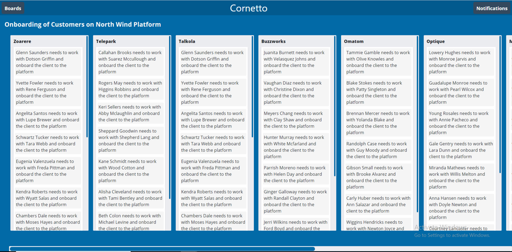

## Practice

### Resolve Impedance Mismatch in Task-Board Renderer

#### Context

##### About Kriya

Kriya is an application to manage and track Tasks. 

Kriya has three components:

- Task Board: Task Board is a board which represents a Project or a place to keep track of information.
- Task List: Lists within Task Board represents various stages of Progress. 
	- They can be used to create a Workflow where cards are moved across list from start to finish
- Cards: The fundamental unit of a board is a card. Cards are used to represent tasks and ideas.
    - A Card is something which needs to be done.


##### Kriya - Bootstrap Phase

Kriya, in it's bootstrapping phase made use of a normalized data structure for it's backend, which as follows:
- BoardId, BoardName, BoardDescription
- ListId, BoardId, ListName
- CardId, ListId, BoardId, CardTitle
- CommentId, CardId, CommentText, Timestamp

##### Kriya - Phase 2

Kriya overtime have now developed a Task Board Render, which can display the data in the following format.



#### Challenge

The input format of data used by Kriya in bootstrapping phase is not the same as the one expected by new Kriya.

##### Input Format of Data

```javascript

sample = {
    "boards": [{
        "boardId": 110,
        "boardTitle": "Onboarding of Customers on North Wind Platform"
    }],
    "lists": [{
            "listId": 992,
            "listTitle": "Zoarere",
            "boardId": 110
        },
        {
            "listId": 990,
            "listTitle": "Telepark",
            "boardId": 110
        }
    ],
    "cards": [{
            "cardId": 1117,
            "cardTitle": "Glenn Saunders needs to work with Dotson Griffin",
            "listId": 992
        },
        {
            "cardId": 1176,
            "cardTitle": "Tammie Gamble needs to work with Olive Knowles",
            "listId": 993
        }
    ],
    "comments": [{
            "commentId": 1599,
            "commentText": "Kent Cole is using the green version of the platform",
            "cardId": 1176
        },
        {
            "commentId": 1557,
            "commentText": "Mayra Pope is using the green version of the platform.",
            "cardId": 1117
        }
  ]
}


```

##### Expected Data Format

```javascript

output = {
  "boards": [
    {
      "boardId":"123",
      "boardTitle":"First Sample Board",
      "members":[
        {
          "memberId":"456",
          "memberName":"xyz"
        }
      ],
      "lists": [
        {
          "listId":"987",
          "listTitle":"First List",
          "cards":[
            {
              "cardId":"102",
              "cardTitle":"First Card",
              "comments":[
                {
                  "commentId":"918",
                  "commentText":"First Comment"
                }
              ]
            }
          ]
        }
      ]
    }
  ]
}


```


Note: 
- Here **Input Format** *IS NOT EQUAL TO* **Expected Format**, resulting in **Impedance Mismatch**
- **Data Wrangling** process helps to resolve Impedance Mismatch.

#### Problem Statement

Resolve Impedence Mismatch for Kriya by providing Data Wrangling (Transformation) Logic, to transform the data structure of data stored in backend to the one used by Task Board Renderer.

#### Implementation Steps

1. Start with boards array.
2. Transform the boards data, such that for each board, the data should contain board-id, board-title and lists.
3. Lists should be retrieved from lists array.
4. Perform filtering operation on lists, such that the lists for a particular board should have its board-id matching with the board-id of that board
5. Each list should also contain cards data alongwith listId and listTitle
6. Cards should be retrieved from cards array.
7. Perform filtering operation on cards, such that, the cards for a particular list should have its list-id matching with the list-id of that list
8. Each card should contain card-id, card-title and count of comments.
9. Comments should be retrieved from comments array.
10. Perform filtering operation on cards, such that, comments counted for a particular card should have their card-id matching with the card-id of that card.

#### Instructions

1. Fork the boilerplate
2. Clone the forked repository
3. Provide the solution code within the `transform()` function of file `transformer.js`.
4. Ensure no other codes get modified, else, the rendering logic will fail to generate desired output.
5. Launch the `index.html` page on the browser to view the rendered output
6. Correct logic will produce the rendered output with boards, lists and cards data as shown in image above
