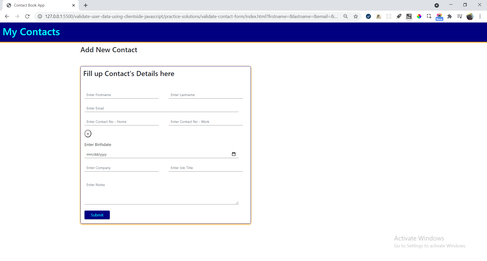

## Practice

### Validate Inputs Captured from Add New Contact Form

#### Context

Prime Solutions is an IT solutions provider company who have earned reputation in providing IT solutions in different business domains

Recently they have received a project to develop contact book app.

Prime Solutions have approached Graffitti designers for a good UI design.

The design is ready and now it needs to be made functional.

The development will be carried out in stages.

In the first stage of development, you as a frontend developer have to develop solution to capture and validate inputs

##### Contact Form

Graffitti Designers have designed contact form that allows app users to provide inputs

Below is the image of UI of contact form.

#### Challenge

The contact form currently has fields that captures basic contact details.

However, more fields can be added going forward

For a lengthy form, upon validations, displaying error messages with the fields would make it difficult to the user to locate fields with invalid values

Hence, it is suggested to have error messages displayed as validation summary block above the form

Also, the fields with invalid values, should be marked with a `*`

The form design also has option to add contact no fields dynamically to capture more contact nos.

The code developed should ensure validations is taken care for these fields added dynamically

#### Problem Statement

Capture and validate inputs submitted by user through add contact form.

If inputs are invalid meaningful error messages should be displayed.

If inputs are valid, the contact details should be stored in contacts collection.

##### Validation Criteria

1. Mandatory Inputs
    - Firstname
    - Email
    - Home Contact No

2. Firstname and Lastname should allow only alphabets and (.)

3. 2 Additional input fields should be created for capturing contact numbers

4. Contact Nos inputted should be in one of the following formats:
    - +910999999999
    - +91099-999-9999
    - +91(099)-999-9999
    - +91(099)9999999
    - +91099 999 9999
    - +91099 999-9999
    - +91(099) 999-9999
    - +91099.999.9999
    - +91 0999999999
    - +91 099-999-9999
    - +91 (099)-999-9999
    - +91 (099)9999999
    - +91 099 999 9999
    - +91 099 999-9999
    - +91 (099) 999-9999
    - +91 099.999.9999

5. Email should be of the format: `example@domain.com`

6. Birthdates for which age is less than 15 years should be disabled

7. Notes should not allow more than 200 characters to be inputted

#### Instructions

1. Download and unzip the boilerplate code.  
2. Run the command `npm install` to install the dependencies required for automated testing.  
3. Open the boilerplate code in VSCode to develop the assignment solution.
4. Provide the solution code within the file `script.js`.
5. Launch the `index.html` page on the browser to view the rendered output.
6. Test the solution locally by running the command `npm run test`. 
    - Following are the error messages expected by test cases in event of validation failure
    1. Firstname is left blank
        - FirstName cannot be left blank
    2. Firstname is invalid
        - FirstName can contain only alphabets and (.)
    3. Email is left blank
        - Email cannot be left blank
    4. Email is invalid
        - Invalid Email
    5. Home Contact Number is left blank
        - Home No cannot be left blank
    6. Home Contact Number is invalid
        - Home Contact No should start with country code prefixed by + and followed by 10 digits
    7. Work Contact Number is invalid
        - Work Contact No should start with country code prefixed by + and followed by 10 digits
    8. Notes contain more than 200 characters
        - Notes should contain maximum of 200 characters

7. Refactor the solution to ensure all test cases are passing.  
8. DO NOT MODIFY THE PROVIDED CODE, ELSE THIS MAY IMPACT THE TEST CODE EXECUTION.
9. Zip the solution code by selecting all the files and folders **excluding the node_modules folder** and give the name same as assignment name to the zipped file.
10. Upload the zipped solution for submission.
